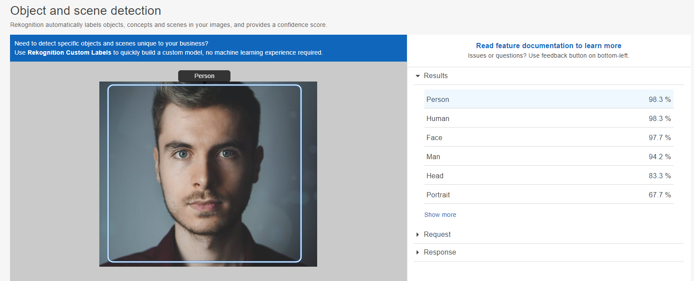

<i>This repo is In Progress.</i>


# AWS Rekognition With Boto3

This repo uses the python package boto3 to upload a video into an S3 bucket and run Amazon Rekognition on it to get facial detection. There are simple and easy to use code to save you time on writing Boto3 based codes to do facial detection.  Only prerequisites is an AWS Account and the instuctions below and you should be able to retrieve facial detection information on desired images. (More to come on videos..)



## Table of Contents
1. [Dependencies](#Dependencies)
2. [Setting up AWS](#AWS)
3. [Upload File to S3](#How-to-Upload-a-File-to-S3-Bucket)
4. [Detect Face & Emotion](#How-to-Detect-Faces-and-emotions-from-an-Image)


## Dependencies

You will need Python 3.5 or above. To use the library you will require the `boto3` python package. 

```
pip install boto3
```

You will also require an AWS Account and an S3 Bucket already created.  Setup the `.aws/credentials` file to be able to run this codebase. 

## AWS

To be able to connect to the AWS Resources you will need to connect to your AWS Account with your secret Access Keys IDS:

### Windows

Create a `C:\Users\USERNAME\.aws\credentials` directory and with the following information

```
[default]
aws_access_key_id = your_access_key_id
aws_secret_access_key = your_secret_access_key
region = your_aws_region
```

### MacOS

From your shell do the following:

```bash
cd ~
mkdir .aws
touch .aws/credentials
```

Open the `credentials` file and insert the information as necessary:

```
[default]
aws_access_key_id = your_access_key_id
aws_secret_access_key = your_secret_access_key
region = your_aws_region
```

## How to Upload a File to S3 Bucket


### Uploading a video file to be used

To upload a file into your S3 Bucket, provide the `filename` and the `bucketname` directly from the command line like so.

```cmd
python src/upload_to_s3.py --filename JonSnow.mp4 --bucketname your-bucket
```

If successful, you should see the following in the command line output:

```cmd
INFO:botocore.credentials:Found credentials in shared credentials file: ~/.aws/credentials
INFO:root:JonSnow.mp4 has been uploaded into the bucket your-bucket
```

NOTE: If you specify a directory for the `filename` argument, S3 will follow the same directory structure in the bucket. i.e. if you enter `data/JonSnow.mp4` as the argument for `filename`, There will be a folder in S3 called `data` with `JonSnow.mp4` inside it. 

## How to Detect Faces and emotions from an Image

Once you have uploaded an image that you are trying to detect faces or emotions from, you can use the `facial_detection.py` file to do so by doing the following:

```bash
python src/facial_detection.py --filename YourImage.png --bucketname your-bucket
```

Currently AWS Rekognition only handles `PNG`, `JPEG` image formats. 

### Output

```json
{
	"FaceDetails": [
		{
			"BoundingBox": {
				"Width": 0.42683255672454834,
				"Height": 0.8336866497993469,
				"Left": 0.29032161831855774,
				"Top": 0.09717020392417908
			},
			"AgeRange": { "Low": 21, "High": 33 },
			"Smile": { "Value": false, "Confidence": 98.56151580810547 },
			"Eyeglasses": { "Value": false, "Confidence": 98.90487670898438 },
			"Sunglasses": { "Value": false, "Confidence": 99.600341796875 },
			"Gender": { "Value": "Male", "Confidence": 99.3250961303711 },
			"Beard": { "Value": true, "Confidence": 88.88880920410156 },
			"Mustache": { "Value": false, "Confidence": 73.39533233642578 },
			"EyesOpen": { "Value": true, "Confidence": 96.98289489746094 },
			"MouthOpen": { "Value": false, "Confidence": 97.51068115234375 },
			"Emotions": [
				{ "Type": "CALM", "Confidence": 96.3896255493164 },
				{ "Type": "SAD", "Confidence": 0.9532904028892517 },
				{ "Type": "ANGRY", "Confidence": 0.9302386045455933 },
				{ "Type": "SURPRISED", "Confidence": 0.5276539921760559 },
				{ "Type": "CONFUSED", "Confidence": 0.45735645294189453 },
				{ "Type": "HAPPY", "Confidence": 0.4365759491920471 },
				{ "Type": "DISGUSTED", "Confidence": 0.20619693398475647 },
				{ "Type": "FEAR", "Confidence": 0.09905973821878433 }
			],
			"Landmarks": [
				{ "Type": "eyeLeft", "X": 0.3850194215774536, "Y": 0.39215198159217834 },
				{ "Type": "eyeRight", "X": 0.5797100067138672, "Y": 0.3932642638683319 },
				...
				{ "Type": "upperJawlineRight", "X": 0.700378954410553, "Y": 0.38627853989601135 }
			],
			"Pose": { "Roll": 0.32532811164855957, "Yaw": -2.45884370803833, "Pitch": -1.9749592542648315 },
			"Quality": { "Brightness": 75.14838409423828, "Sharpness": 83.14741516113281 },
			"Confidence": 99.9998550415039
		}
	]
}
```